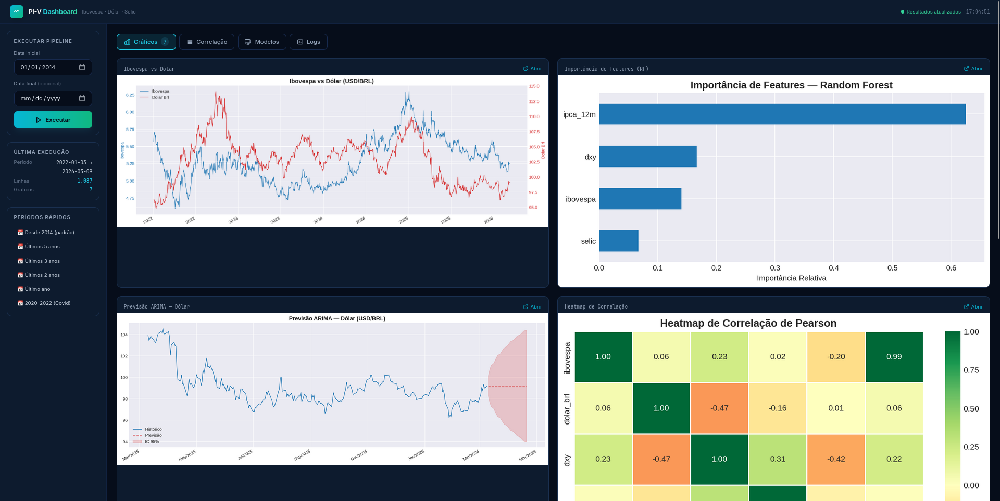
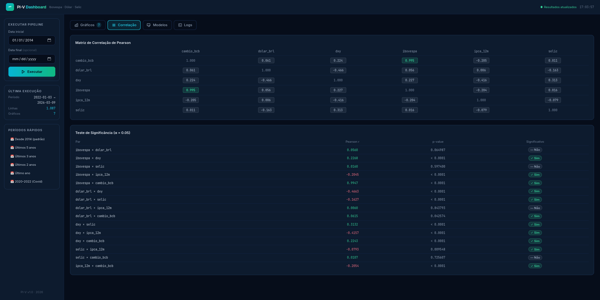
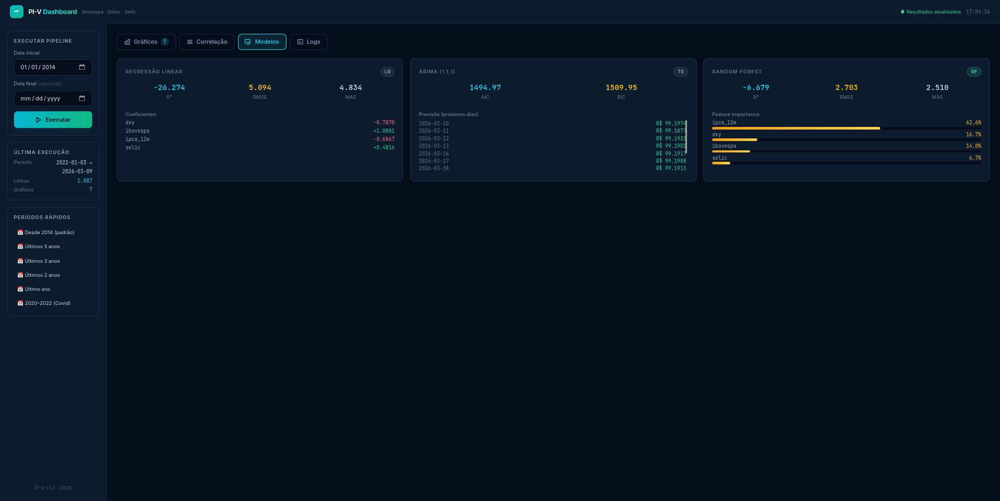
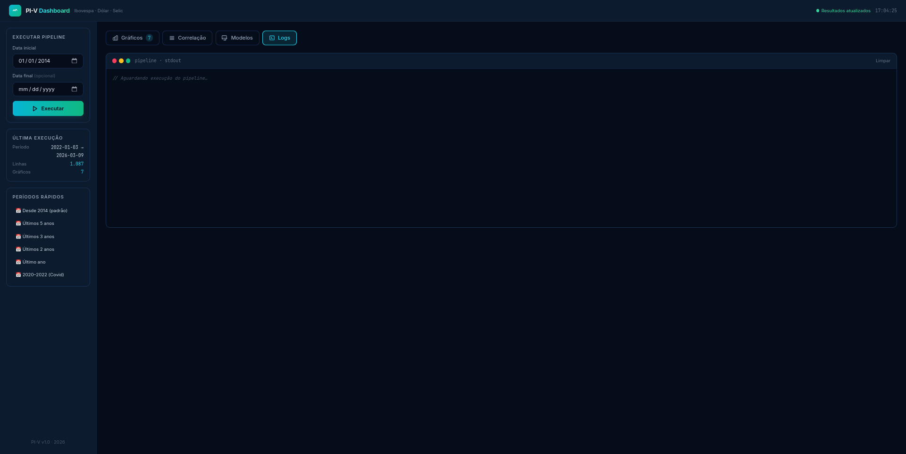

# PI-V — Análise Quantitativa: Ibovespa, Dólar & Política Monetária

> Modelo quantitativo de relação entre política monetária (Selic/IPCA), mercado acionário (Ibovespa) e câmbio (USD/BRL) no Brasil — com dashboard web interativo.

---

## O que é o projeto

O **PI-V** é um pipeline de análise macro-financeira que:

- Coleta automaticamente dados históricos de **Ibovespa**, **Dólar (USD/BRL)** e **DXY** via `yfinance`, e de **Selic** e **IPCA** via a API pública do Banco Central do Brasil (SGS / `python-bcb`).
- Calcula a **correlação de Pearson** e **correlações rolling** (janelas de 30, 60 e 90 dias) entre os ativos.
- Testa a **significância estatística** (p-value, α = 0.05) de cada par de variáveis.
- Treina três modelos preditivos para o câmbio (USD/BRL):
  - **Regressão Linear Múltipla** — interpretável e explicativa.
  - **ARIMA(1,1,1)** — captura padrões temporais (tendência + sazonalidade).
  - **Random Forest** — captura não-linearidades entre as variáveis.
- Gera 7 gráficos profissionais salvos em `reports/`.
- Disponibiliza um **dashboard web** para visualização e controle em tempo real.
- (Opcional) Envia o relatório automaticamente por **e-mail** e/ou **Telegram**.

---

## Screenshots






---

## Estrutura do projeto

```
PI-V/
├── src/
│   ├── data/
│   │   ├── market_data.py       ← Ibovespa, Dólar, DXY via yfinance
│   │   └── bcb_data.py          ← Selic e IPCA via python-bcb (API SGS/BCB)
│   ├── analysis/
│   │   ├── correlation.py       ← Pearson, rolling correlation, p-value
│   │   └── models.py            ← LinearRegression, ARIMA, RandomForest
│   ├── visualization/
│   │   └── charts.py            ← Geração e salvamento de gráficos
│   └── notifications/
│       ├── email_sender.py      ← Envio por SMTP
│       └── telegram_bot.py      ← Envio via Bot API do Telegram
├── config/
│   └── settings.py              ← Leitura do .env
├── templates/
│   └── index.html               ← Dashboard web (Alpine.js + Tailwind)
├── reports/                     ← Gráficos e JSON gerados (ignorado pelo git)
├── app.py                       ← Servidor Flask do dashboard
├── main.py                      ← Orquestra o pipeline completo (CLI)
├── requirements.txt
├── .env.example                 ← Modelo de configuração
├── .gitignore
└── README.md
```

---

## O que cada módulo faz

| Módulo | Responsabilidade |
|---|---|
| `src/data/market_data.py` | Baixa preços de fechamento de `^BVSP`, `BRL=X` e `DX-Y.NYB` via `yfinance` |
| `src/data/bcb_data.py` | Séries 11 (Selic) e 13522 (IPCA 12m) via `python-bcb` |
| `src/analysis/correlation.py` | `pearson_matrix`, `rolling_correlation`, `correlation_significance` |
| `src/analysis/models.py` | `linear_regression_model`, `arima_model`, `random_forest_model` |
| `src/visualization/charts.py` | Gráfico duplo, heatmap, rolling, forecast ARIMA, feature importance |
| `src/notifications/email_sender.py` | Envia PDF + imagens via SMTP com TLS |
| `src/notifications/telegram_bot.py` | Envia mensagem, fotos e documentos via Telegram Bot API |
| `config/settings.py` | Carrega variáveis do `.env` (tokens, e-mails, período padrão) |
| `app.py` | Servidor Flask: dashboard web + API REST + streaming de logs via SSE |
| `main.py` | Pipeline completo via CLI: coleta → análise → gráficos → modelos → (envio) |

---

## Instalação

### 1. Clone o repositório e entre na pasta

```bash
git clone <url-do-repositório>
cd PI-V
```

### 2. Crie e ative o ambiente virtual

```bash
python3 -m venv .venv
source .venv/bin/activate       # Linux / macOS
# .venv\Scripts\activate        # Windows
```

### 3. Instale as dependências

```bash
pip install -r requirements.txt
```

---

## Configuração

```bash
cp .env.example .env
```

Edite o `.env` com suas credenciais:

```env
# Telegram Bot
TELEGRAM_TOKEN=seu_token_aqui
TELEGRAM_CHAT_ID=seu_chat_id_aqui

# E-mail SMTP (ex.: Gmail com App Password)
EMAIL_HOST=smtp.gmail.com
EMAIL_PORT=587
EMAIL_USER=seu_email@gmail.com
EMAIL_PASS=sua_senha_de_app
EMAIL_TO=destinatario@email.com

# Período de coleta padrão
DEFAULT_START=2014-01-01
```

> As notificações são **opcionais** — o pipeline roda normalmente sem `.env` preenchido.

---

## Como executar

### Dashboard Web (recomendado)

```bash
source .venv/bin/activate
python3 app.py
# Abra http://localhost:5000
```

O dashboard oferece:

| Aba | Conteúdo |
|---|---|
| **Gráficos** | Grid com os 7 charts; clique para abrir em tamanho real |
| **Correlação** | Heatmap colorido (Pearson) + tabela de p-values com badge ✓/— |
| **Modelos** | Cards com R², RMSE, MAE; coeficientes LR; previsão ARIMA; barras de feature importance RF |
| **Logs** | Terminal ao vivo com streaming da saída do pipeline |

A sidebar permite selecionar o período e clicar **Executar** para rodar o pipeline sem sair do browser.

### CLI (linha de comando)

```bash
# pipeline completo (sem envio de notificações)
python3 main.py

# Período personalizado
python3 main.py --start 2018-01-01 --end 2024-12-31

# Com envio por e-mail
python3 main.py --email

# Com envio pelo Telegram
python3 main.py --telegram

# Ambos
python3 main.py --email --telegram
```

Os gráficos ficam salvos em `reports/`.

---

## API do dashboard

| Método | Rota | Descrição |
|---|---|---|
| `GET` | `/` | Dashboard web |
| `GET` | `/api/run?start=&end=` | Executa pipeline (SSE — stream de logs ao vivo) |
| `GET` | `/api/results` | Último `results.json` (correlações + métricas dos modelos) |
| `GET` | `/api/charts` | Lista de PNGs gerados |
| `GET` | `/reports/<arquivo>` | Serve gráficos da pasta `reports/` |

---

## Gráficos gerados

| Arquivo | Conteúdo |
|---|---|
| `dual_line_ibovespa_dolar.png` | Ibovespa vs Dólar — dois eixos Y |
| `selic_vs_ibovespa.png` | Selic vs Ibovespa |
| `selic_vs_dolar_brl.png` | Selic vs Dólar |
| `heatmap_correlacao.png` | Matriz de correlação de Pearson |
| `rolling_correlation.png` | Correlação rolling 30/60/90 dias |
| `forecast_arima.png` | Previsão ARIMA com IC 95% |
| `feature_importance_rf.png` | Importância de features (Random Forest) |

---

## Fundamentação teórica (resumo)

| Cenário | Efeito esperado |
|---|---|
| **Juros baixos** | Crédito barato → incentivo a risco → ↑ Ibovespa · ↓ Dólar |
| **Juros altos** | Renda fixa mais atrativa → migração de capital → ↓ Ibovespa · ↑ Dólar |
| **Inflação alta** | Pressão cambial → ↑ Dólar |

Na prática, fatores externos (Fed, commodities, risco fiscal) podem distorcer essas relações — por isso o projeto mede a correlação empiricamente e não apenas teoricamente.

---

## Dependências principais

| Pacote | Uso |
|---|---|
| `yfinance` | Dados de mercado (Ibovespa, Dólar, DXY) |
| `pandas` / `numpy` | Manipulação de dados |
| `matplotlib` / `seaborn` | Visualização |
| `statsmodels` | Modelo ARIMA |
| `scikit-learn` | Regressão Linear + Random Forest |
| `scipy` | Teste de significância (p-value) |
| `flask` | Dashboard web e API REST |
| `python-bcb` | Séries do BCB (Selic, IPCA) via API SGS |
| `requests` | Telegram Bot API |
| `python-dotenv` | Leitura do `.env` |
| `reportlab` | Geração de PDF |

---

## Licença

MIT
