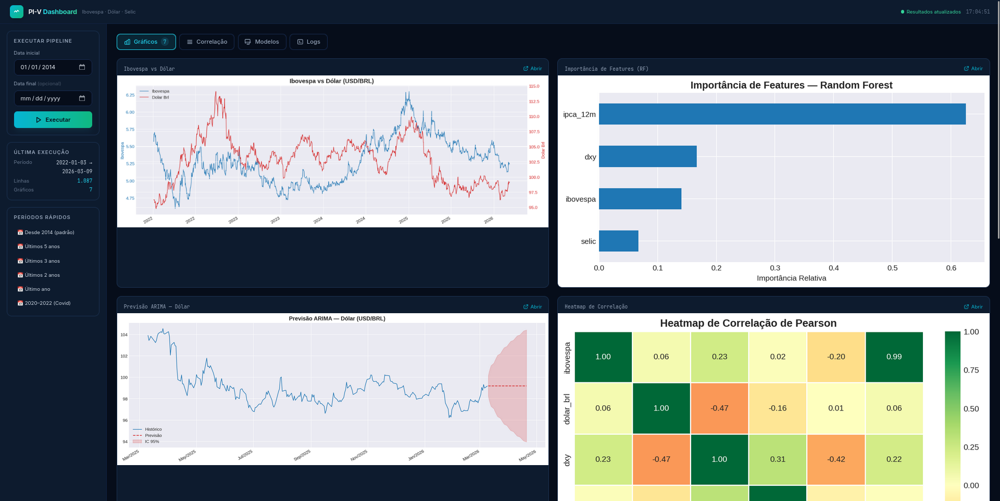
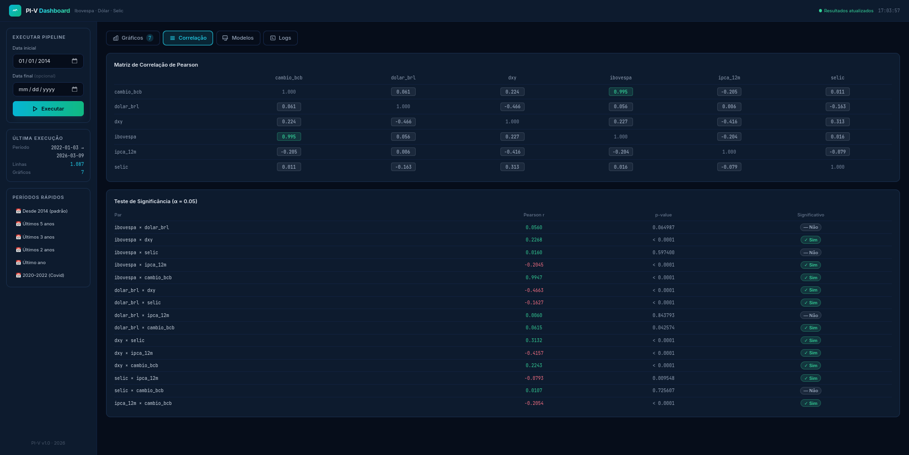
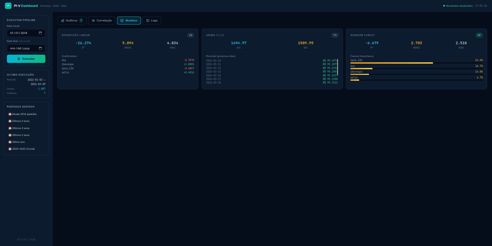
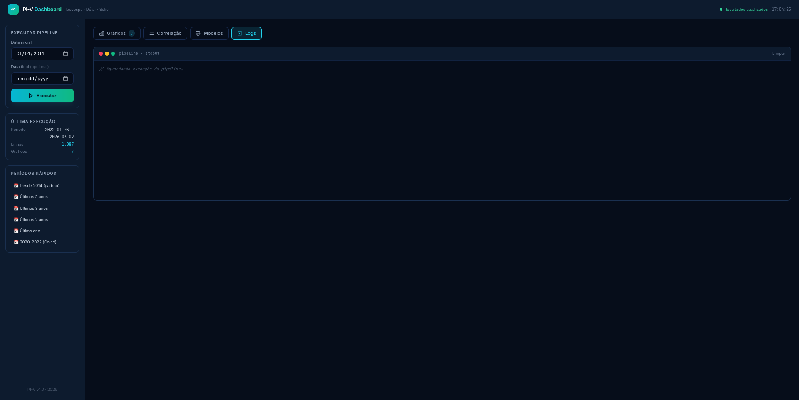

# PI-V — Analise Quantitativa de Ibovespa, Dolar e Politica Monetaria

Pipeline de dados macro-financeiros com dashboard web, modelos preditivos e envio automatizado de relatorio consolidado em PDF.

## Visao geral

O projeto PI-V executa um fluxo completo:

1. Coleta dados de mercado via yfinance:
- Ibovespa (^BVSP)
- Dolar BRL (BRL=X)
- DXY (DX-Y.NYB)

2. Coleta series do Banco Central via python-bcb/SGS:
- Selic (serie 11)
- IPCA 12 meses (serie 13522)
- Cambio BCB (serie 1)

3. Faz analise estatistica:
- Matriz de correlacao de Pearson
- Correlacao rolling (30, 60 e 90 dias)
- Teste de significancia (p-value)

4. Treina modelos para previsao do dolar_brl:
- Regressao Linear Multipla
- ARIMA(1,1,1)
- Random Forest Regressor

5. Gera artefatos em reports/:
- 7 graficos PNG
- relatorio_plots.pdf (capa + uma pagina por grafico)
- results.json com metricas e metadados

6. Opcionalmente envia notificacoes:
- E-mail com anexo PDF
- Telegram com resumo + PDF

## Screenshots






## Estrutura do projeto

```text
PI-V/
├── app.py
├── main.py
├── config/
│   └── settings.py
├── src/
│   ├── data/
│   │   ├── market_data.py
│   │   └── bcb_data.py
│   ├── analysis/
│   │   ├── correlation.py
│   │   └── models.py
│   ├── visualization/
│   │   └── charts.py
│   └── notifications/
│       ├── email_sender.py
│       └── telegram_bot.py
├── templates/
│   └── index.html
├── static/
├── reports/
├── screenshots/
├── requirements.txt
└── .env.example
```

## Modulos principais

| Modulo | Responsabilidade |
|---|---|
| src/data/market_data.py | Download de Ibovespa, dolar_brl e dxy via yfinance |
| src/data/bcb_data.py | Download de selic, ipca_12m e cambio_bcb via BCB/SGS |
| src/analysis/correlation.py | Pearson, rolling_correlation e teste de significancia |
| src/analysis/models.py | Regressao Linear, ARIMA e Random Forest |
| src/visualization/charts.py | Geracao de PNGs e consolidacao em PDF (PdfPages) |
| src/notifications/email_sender.py | Envio SMTP com anexos (PDF com MIME apropriado) |
| src/notifications/telegram_bot.py | Envio de mensagem e documento via Telegram Bot API |
| main.py | Orquestracao do pipeline e disparo opcional de envio |
| app.py | Dashboard Flask + APIs + stream de logs (SSE) |

## Instalacao

1. Clonar e entrar na pasta

```bash
git clone <url-do-repositorio>
cd PI-V
```

2. Criar ambiente virtual

```bash
python3 -m venv .venv
source .venv/bin/activate
```

3. Instalar dependencias

```bash
pip install -r requirements.txt
```

## Configuracao

```bash
cp .env.example .env
```

Preencha o arquivo .env:

```env
TELEGRAM_TOKEN=seu_token_aqui
TELEGRAM_CHAT_ID=seu_chat_id_aqui

EMAIL_HOST=smtp.gmail.com
EMAIL_PORT=587
EMAIL_USER=seu_email@gmail.com
EMAIL_PASS=sua_senha_de_app
EMAIL_TO=destinatario@email.com

DEFAULT_START=2014-01-01
```

Observacoes:
- As notificacoes sao opcionais.
- O pipeline roda sem enviar nada se voce nao usar --email ou --telegram.
- Se usar envio, as credenciais correspondentes precisam estar configuradas.
- Consultas ao BCB com intervalo maior que 10 anos sao quebradas automaticamente em blocos.
- Em caso de timeout do BCB, o sistema faz retry automatico e fallback por serie para aumentar a robustez.

## Como executar

### CLI

```bash
# Pipeline completo sem envio
python3 main.py

# Periodo personalizado
python3 main.py --start 2018-01-01 --end 2024-12-31

# Envio por e-mail
python3 main.py --email

# Envio por Telegram
python3 main.py --telegram

# Ambos
python3 main.py --email --telegram
```

### Dashboard web

```bash
python3 app.py
```

Abra: http://localhost:5000

No dashboard, voce consegue:
- Executar pipeline por periodo
- Acompanhar logs em tempo real
- Ver graficos, correlacoes e metricas dos modelos

## Artefatos gerados

Arquivos gerados em reports/ apos cada execucao:

- dual_line_ibovespa_dolar.png
- selic_vs_ibovespa.png
- selic_vs_dolar_brl.png
- heatmap_correlacao.png
- rolling_correlation.png
- forecast_arima.png
- feature_importance_rf.png
- relatorio_plots.pdf
- results.json

Sobre o PDF:
- Gerado automaticamente no pipeline.
- Inclui capa e paginas de plot com layout padronizado.
- Utilizado como anexo no e-mail e como documento no Telegram.

## API do dashboard

| Metodo | Rota | Descricao |
|---|---|---|
| GET | / | Interface web |
| GET | /api/run?start=&end= | Executa pipeline com stream SSE de logs |
| GET | /api/results | Retorna o ultimo results.json |
| GET | /api/charts | Lista somente PNGs de reports/ |
| GET | /reports/<arquivo> | Serve arquivos de reports/ (PNG, PDF, JSON etc.) |

## Dependencias

Dependencias principais usadas no projeto:

- yfinance
- pandas
- numpy
- matplotlib
- seaborn
- statsmodels
- scikit-learn
- scipy
- requests
- python-dotenv
- python-bcb
- flask

## Licenca

MIT
